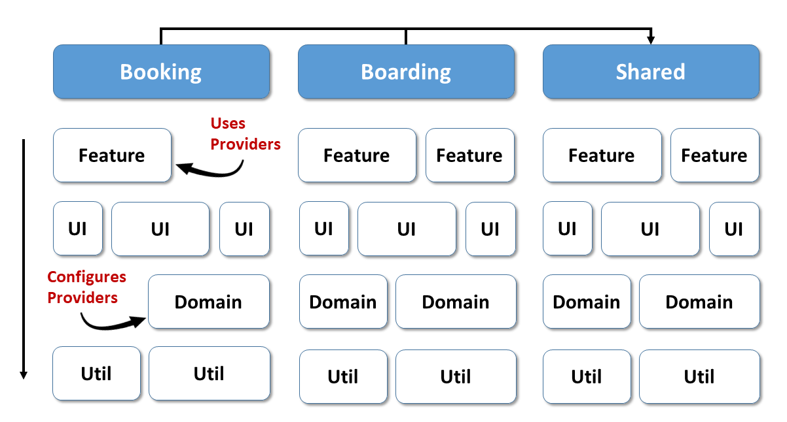

# Routing and Standalone Components

Since its first days, the Angular Router has always been quite coupled to NgModules. Hence, one question that comes up when moving to Standalone Components is: How will routing and lazy loading work in a world without NgModules?. This article provides answers and also shows, why the router will become more important for Dependency Injection.

[📂 Source Code (CLI Example)](TODO!)
[📂 Source Code (Nx Example)](TODO!)

## Providing the Routing Configuration

When bootstrapping a standalone component, we can provide services for the root scope. For the sake of backwards compatibility, the function ``importProvidersFrom`` allows for importing them from existing NgModules:

```typescript
// main.ts

import { importProvidersFrom } from '@angular/core';
import { bootstrapApplication } from '@angular/platform-browser';
import { RouterModule } from '@angular/router';
import { APP_ROUTES } from './app/app.routes';
[...]

bootstrapApplication(AppComponent, {
  providers: [
    // Configuring the Router
    importProvidersFrom(RouterModule.forRoot(APP_ROUTES)),

    importProvidersFrom(StoreModule.forRoot(reducer)),
    importProvidersFrom(EffectsModule.forRoot()),
    importProvidersFrom(StoreDevtoolsModule.instrument()),

    importProvidersFrom(HttpClientModule),
  ]
});
```

This bridges the gap between NgModules and Standalone Components. The shown example uses this concept to provide services for the router, NGRX, and the ``HttpClientService``. As usual, the used ``RouterModule`` is called with ``forRoot`` which takes the top-level router configuration.

Please note, that the usage of ``importProvidersFrom`` will peak off over time, as more and more libraries will provide functions for directly setting up and configuring their providers. For instance, there is the idea of providing a ``configureRouter`` function for setting up the router:

```typescript
providers:[
    configureRouter(APP_ROUTES)    
]
```

The exact name of these function will be defined soon. While naming is hard in general, this is also a critical topic because it's vital to establish a naming pattern for such methods. Similar to ``forRoot``, ``forChild``, or ``forFeature``, Angular developers should know for which function to look out when adding a new library. 

## Lazy Loading with Standalone Components

In the past, a lazy route pointed to an NgModule with child routes. As there are no ``NgModules`` anymore, ``loadChildren`` can now directly point to a lazy routing configuration:

```typescript
// app.routes.ts

import { Routes } from '@angular/router';
import { HomeComponent } from './home/home.component';

export const APP_ROUTES: Routes = [
    {
        path: '',
        pathMatch: 'full',
        redirectTo: 'home'
    },
    {
        path: 'home',
        component: HomeComponent
    },

    // Option 1: Lazy Loading another Routing Config
    {
        path: 'flight-booking',
        loadChildren: () =>
            import('./booking/flight-booking.routes')
                .then(m => m.FLIGHT_BOOKING_ROUTES)
    },

    // Option 2: Directly Lazy Loading a Standalone Component
    {
        path: 'next-flight',
        loadComponent: () => 
            import('./next-flight/next-flight.component')
                .then(m => m.NextFlightComponent)
    },
    [...]
];
```

This reduces the indirection via an NgModule and makes our code more explicit. As an alternative, a lazy route can also directly point to a Standalone Component. For this, the above shown ``loadComponent`` property is used.

I expect, that most teams will favor the first option, because normally, an application needs to lazy loading several routes that go together.

## Environment Injectors: Services for Specific Routes

With ``NgModule``s, each lazy module introduced a new injector and hence a new injection scope. This scope was used for providing services only needed by the lazy chunk in question. For instance, this was used to set up a feature for NGRX.

To cover such use cases, the Router now allows for introducing providers for each route. These services can be used by the route in question and their child routes:

```typescript
// booking/flight-booking.routes.ts

export const FLIGHT_BOOKING_ROUTES: Routes = [{
    path: '',
    component: FlightBookingComponent,
    providers: [
        importProvidersFrom(StoreModule.forFeature(bookingFeature)),
        importProvidersFrom(EffectsModule.forFeature([BookingEffects])),
    ],
    children: [
        {
            path: '',
            pathMatch: 'full',
            redirectTo: 'flight-search'
        },
        {
            path: 'flight-search',
            component: FlightSearchComponent
        },
        {
            path: 'passenger-search',
            component: PassengerSearchComponent
        },
        {
            path: 'flight-edit/:id',
            component: FlightEditComponent
        }
    ]
}];
```

As shown here, we can provide services for several routes by grouping them as child routes. In these cases, a component-less parent route with an empty path (``path: ''``) is used. This pattern is already used for years to assign Guards to a group of routes.

Technically, using providers in a router configuration introduces a new injector at the level of the route. Such an Injector is called Environment Injector and replaces the concept of the former (Ng)Module Injectors. The root injector and the platform injector are seen as further Environment Injectors.

Interestingly, this also decouples lazy loading from introducing further injection scopes. Previously, each lazy NgModule introduced a new injection scope. Now, lazy loading itself doesn't influence the scopes. Instead, you define new scopes by adding a providers section to your routes. Also, these routes can but don't need to be lazy. 

## Setting up Your Environment: ENVIRONMENT_INITIALIZER

Some libraries used the constructor of lazy ``NgModule`` for their initialization. To further support this approach without ``NgModule``s, there is now the concept of an ``ENVIRONMENT_INITIALIZER``:

```typescript
export const FLIGHT_BOOKING_ROUTES: Routes = [{
    path: '',
    component: FlightBookingComponent,
    providers: [
        importProvidersFrom(StoreModule.forFeature(bookingFeature)),
        importProvidersFrom(EffectsModule.forFeature([BookingEffects])),
        {
            provide: ENVIRONMENT_INITIALIZER,
            multi: true,
            useValue: () => inject(InitService).init()
        }
    ],
    children: [
        [...]
    ]
}
```

Basically, the ``ENVIRONMENT_INITIALIZER`` provides a function executed when the Environment Injector is initialized. The flag ``multi: true`` already indicates that you can have several such initializers per scope.

## Providers Setup as a Black Box?

There are situations, where you want to use services that are setup inside a library. While the services are part of the library's public API, their setup remains an implementation detail. 

We encountered such a situation before, when we discussed the idea of a ``configureRouter`` function provided by the Angular Router. Another example for this comes up when using a layered architecture as seen in lots of Nx workspaces nowadays: 



Here, the domain library manages the state for one or several feature libraries. For this, it uses an NGRX feature slice. As the domain library does not use routing, we cannot provide the NGRX feature slice there. Nethertheless, only the domain library knows how to setup the providers.

Hence, the domain library only provides a function returning the needed providers:

```typescript
// libs/booking/domain/src/lib/domain.providers.ts

[...]

export function forBookingDomain() {
    return [
        importProvidersFrom(StoreModule.forFeature(bookingFeature)),
        importProvidersFrom(EffectsModule.forFeature([BookingEffects])),
    ];
}
```

This function is used for setting up an Environment Injector in the feature library: 

```typescript
// libs/booking/feature-book/src/lib/flight-booking.routes.ts

import { Routes } from '@angular/router';
import { forBookingDomain } from '@nx-example/booking/domain';
[...]

export const FLIGHT_BOOKING_ROUTES: Routes = [{
    path: '',
    component: FlightBookingComponent,
    providers: [
        forBookingDomain()
    ],
    children: [
        {
            path: '',
            pathMatch: 'full',
            redirectTo: 'flight-search'
        },
        {
            path: 'flight-search',
            component: FlightSearchComponent
        },
        {
            path: 'passenger-search',
            component: PassengerSearchComponent
        },
        {
            path: 'flight-edit/:id',
            component: FlightEditComponent
        }
    ]
}];
```

If several features needed to use the same state, we could also pull the call to ``forBookingDomain`` up to the app level.
